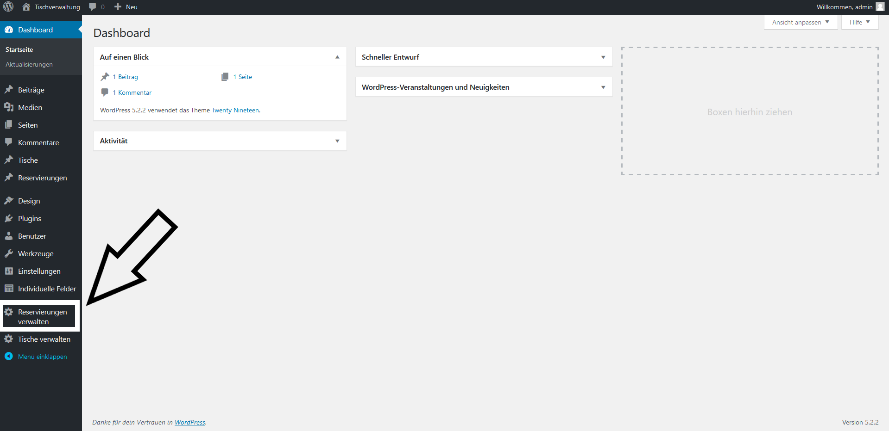
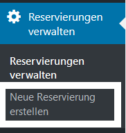
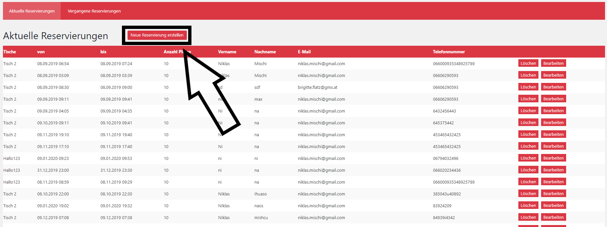
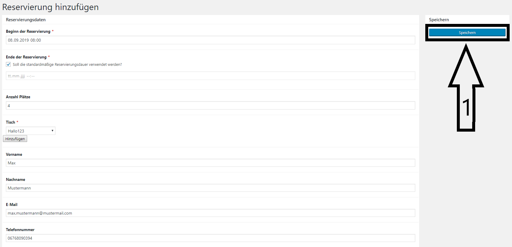

## Add Reservation (Backend)

### Get to the Plugin

First enter the wordpress dashboard. When you have done that, you will find the item "Reservierung verwalten" at the bottom left.

### There are two possibilities to get to the "Create Reservations" - Page
#### 1. directly in the menu

there is a direct link under the menuitem "manage reservations"  

#### 2. indirectly through "Reservationen verwalten" - Page

There is a button on the top of the page.

### Create new Reservation

When you have used one of the two possibilities to get to the "Create Reservation" - Page you will get to a form. Fill in all your data and click "Speichern" (1) to save the reservation.

