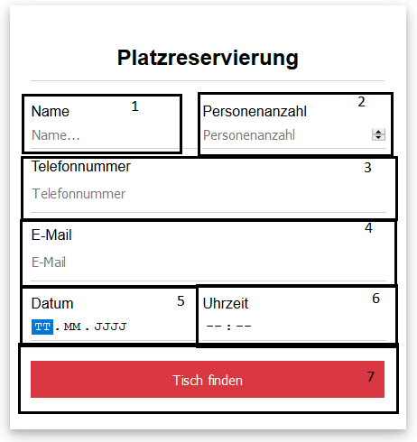

## Add Reservation (Frontend)

Alle Teilcomponents der Eingabefläche befinden sich in [ **/frontend/src/components/InputFormComponents/** ](https://github.com/towa-digital/intern-table-reservation/tree/master/frontend/src/components/InputFormComponents)

### 1 - Eingabefeld für den Namen

#### Component

InputFormName.vue

### 2 - Eingabefeld für die Antahl der Personen

#### Component

InputFormNumberOfPersons.vue

### 3 - Eingabefeld für die Telefonnummer

#### Component

InputFormPhonenumber.vue

### 4 - Eingabefeld für die E-Mailadresse

#### Component

InputFormEmail.vue

### 5 - Eingabefeld für das Datum

#### Component

InputFormDate.vue

### 6 - Eingabefeld für die Uhrzeit

#### Component

InputFormTime.vue

### 7 - Submit-Button

Button um die Reservierung abzuschließen.

#### Component

InputFormSubmit.vue

