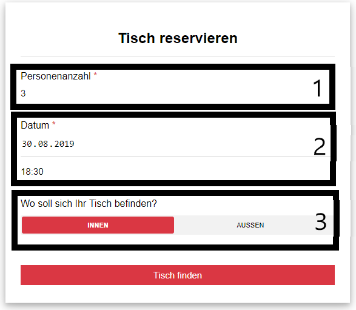

# Add Reservation (Frontend)

Alle Teilcomponents der Eingabefläche befinden sich in [**/frontend/src/components/InputFormComponents/**](https://github.com/towa-digital/intern-table-reservation/tree/master/frontend/src/components/InputFormComponents)

## Overall

In the input-form, you can always go back by pushing the "zurück"-Button. Items with stars are required and can not be left empty. Items without stars are optional fields.

## 1 - Step One

In this step, you have to enter how many seats (1) you need and when (2) you want to reserve for. To do so you have to input the Number of Persons and the Date.

### Components used

InputFormDate.vue InputFormNumberOfPersons.vue

## 2 - Step Two

At the second step, you can choose between different possible tables. We filter the tables before they appear on the site, so you can only choose tables which are possible for the number of people and the time.

When you want to reserve more than one table, you have the option to add a table (2). You can reserve up to three tables.

### Component used

InputFormTable.vue

## 3 - Step Three

When you have completed the first two steps, there is only one step left. In this step, you have to insert your data. When you have done that, click ok and the reservation is complete.

### Components

InputFormName.vue InputFormPhonenumber.vue InputFormEmail.vue
