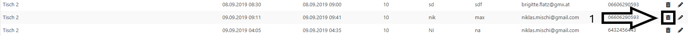

# Delete Reservation

## Get to the Plugin

You can find the tutorial [here](<https://github.com/towa-digital/intern-table-reservation/blob/master/docs/features/manage%20reservations/add%20reservation%20(backend).md>)

## Delete Reservations

Once you have clicked on the plugin, a page with a list of all reservations appears. The only thing you have to do to delete the reservation, is to click on the little trash icon (1) on the right hand side.

