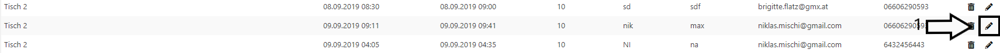
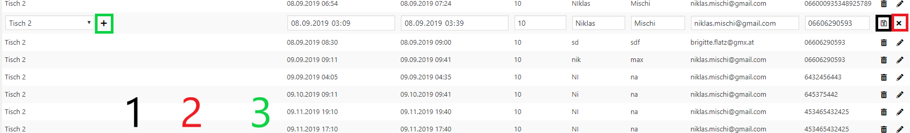

## Edit Reservations

### Get to the Plugin

You can find the tutorial [here](https://github.com/towa-digital/intern-table-reservation/blob/master/docs/features/manage%20reservations/add%20reservation%20(backend).md)

### Update Reservations

Once you have clicked on the plugin, a page with a list of all reservations appears. The only thing you have to do to edit the reservation, is to click on the little pencil icon (1) on the right hand side.  

Once you have clicked on this icon you can change the data. Just tip in the new data and click on the save icon (1) on the right side. When you want to cancel just click the x (2). On the Butten with the + (3) you can add more tables to one reservation.

