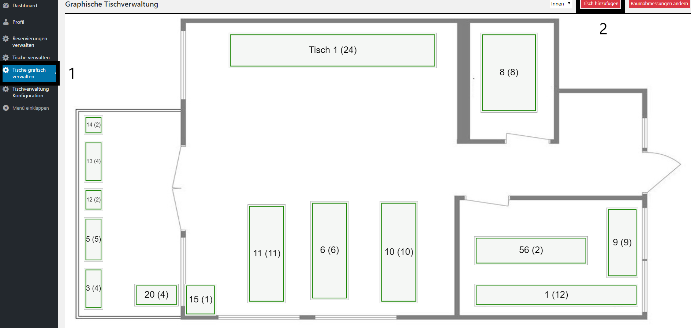
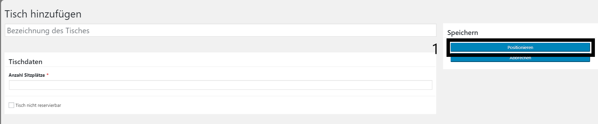

# Add Table

## There are two possibilities to get to the "Create Table" - Page

### 1. without graphic

First enter the wordpress dashboard. When you have done that, you will find the item "Tische verwalten" at the bottom left.

or

there is a direct link under the menuitem "Tische verwalten"

There is a button on the top of the page.

## Create new Table

When you have used one of the two possibilities to get to the "Create Table" - Page you will get to a form. Fill in all your data and click "Speichern" (1) to save the table.

### 2. with graphics

To add a table with graphics you have to click the menulink "Tische graphisch verwalten" (1) you should get a overview of your room and the tables with its positions. 

When you press "Tisch hinzufügen" (2) following windows will appear. The only difference between the step without graphic is that you have to define the position of the table. You can do that with pressing the button "Positionieren" (1) and drawing a rect. Then press save ("Speichern") and the table will appear in the overview and the frontend.

