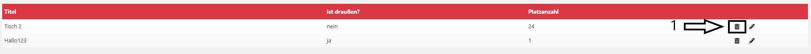

# Delete Table

## Get to the Plugin

You can find the tutorial [here](https://github.com/towa-digital/intern-table-reservation/blob/master/docs/features/manage%20tables/add%20table.md)

## Delete Tables

Once you have clicked on the plugin, a page with a list of all tables appears. The only thing you have to do to delete the table, is to click on the little trash icon (1) on the right hand side.

