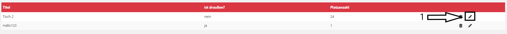
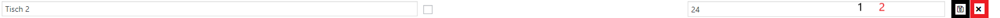
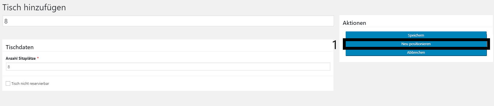

# Edit Table

## Get to the Plugin

You can find the tutorial [here](https://github.com/towa-digital/intern-table-reservation/blob/master/docs/features/manage%20tables/add%20table.md)

## Update Table without graphics

Once you have clicked on the plugin, a page with a list of all tables appears. The only thing you have to do to edit the table, is to click on the little pencil icon (1) on the right hand side.

Once you have clicked on this icon you can change the data. Just tip in the new data and click on the save icon (1) on the right side. When you want to cancel just click the x (2).

## Update Table with graphics

You can also edit a table by clicking on it in the graphic overview. Following window will appear.

You can change the default setting with updating the input fields and press "Speichern" but you can also change the tbles position with pressing "neu positionieren" (1). YOu can draw a new rect like you did when you created the table press "Übernehmen" and then "Speichern".
